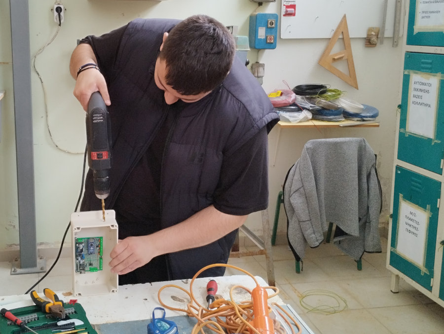

<H2>Α. Εξοικονόμηση νερού</H2>
Σχεδιάσαμε και κατασκευάσαμε μονάδα αυτόματου ποτίσματος με αισθητήρες υγρασίας και θερμοκρασίας στην ρίζα των φυτών ώστε να ποτίζονται αυτόματα μόνο όταν είναι απαραίτητο. Αν και στον αρχικό σχεδιασμό σκοπευαμε να κατασκευάσουμε τουλάχιστον δύο μονάδες, τελικά κατασκευάσαμε μία διπλή. Η μονάδα υποστηρίζει δύο ανεξάρτητες γραμμές ποτίσματος με ανεξάρτητους αισθητήρες και τοποθετήθηκε στον κήπο του Ε.Κ. Οι μονάδες αυτές επικοινωνούν μέσω διαδικτύου με το κεντρικό σύστημα διαχείρησης. 
Ακολουθεί το block διάγραμμα της μονάδας

  

<H3>Κατασκευή ηλεκτρονικού κυκλώματος</H3>
Έγινε κατασκευή του πρωτοτύπου σε διάτρητη πλακέτα perfboard. Πάνω στην πλακέτα τοποθετήθηκαν όλα τα εξαρτήματα και τα αρθρώματα και κολλήθηκαν από την κάτω πλευρά με λεπτά σύρματα. Ακολουθεί το θεωρητικό κύκλωμα της μονάδας.

  

Κόλληση των εξαρτημάτων και αρθρωμάτων σύμφωνα με το προηγούμενο σχέδιο
<table align="center">
 <tr>
  <td></td>
  <td></td>
  </tr>
</table>
Το τελικό αποτέλεσμα και οι ηλεκτρολογικές συνδέσεις των αισθητήρων - ενεργοποιητών
<table align="center">
 <tr>
  <td></td>
  <td></td>
  </tr>
</table>
<H3>Σχεδιασμός και εκτύπωση συστήματος ηλεκτροβάνας</H3>
Επειδή οι ηλεκτροβάνες άρδευσης είναι ακριβές και οι φθηνότερες βαλβίδες λειτουργούν μόνο σε δύο καταστάσεις (ανοιχτό/κλειστό) αποφασίσαμε να χρησιμοποιήσουμε απλές βάνες (κόστος περίπου 1€) και να τις περιστρέφουμε με servo κινητήρα. Για τον λόγο αυτό σχεδιάσαμε στο Freecad μια απλή βάση στήριξης της βάνας και του servo motor. Τα αρχεία σε μορφή stl <a href="3D">βρίσκονται εδώ</a>.
<table align="center">
 <tr>
  <td></td>
  <td>
  </td>
  </tr>
</table>
<H3>Προγραμματισμός</H3>
Η μονάδα έχει δύο modules με microcontrollers. Το Arduino Nano και το ESP01. Το πρώτο δέχεται τα σήματα των αισθητήρων και ελέγχει τους ενεργοποιητές, ενώ το δεύτερο είναι υπεύθυνο για την σύνδεση στο διαδίκτυο μέσω WiFi και γενικά κάνει την περισσότερη δουλειά. Τα δύο modules επικοινωνούν μέσω σειριακής θύρας σε ρυθμό 9600bps. Ο κώδικας είναι γραμμένος σε C++ (Arduino wiring) και χρησιμοποιήσαμε το IDE vscode με την επέκταση του PlatformIO. Επίσης στο ESP01 λειτουργεί και ένας mini Web Server γι' αυτό έχουμε και λίγο κώδικα σε HTML καθώς και JQuery - JavaScript.
<H3>Δοκιμές</H3>
Έγιναν πολλές δοκιμές και πολλές διορθώσεις μέχρι να πετύχουμε ικανοποιητικά αποτελέσματα. Αρχικά δοκιμάσαμε μέσα στο εργαστήριο την επικοινωνία με το διαδίκτυο, τους αισθητήρες, την κίνηση των ηλεκτροβανών και μετά έγιναν οι δοκιμές σε εξωτερικό περιβάλλον.
<table align="center">
 <tr>
  <td></td>
  <td></td>
  <td>
  </td> 
  </tr>
</table>
<H3>Μηχανολογική κατασκευή - Τοποθέτηση σε αδιάβροχο ηλεκτρολογικό κουτί</H3>
Με την βοήθεια του μαθητή από τον ηλεκτρολογικό τομέα έγινε η κατασκευή του κουτιού. Επειδή η μονάδα λειτουργεί σε εξωτερικό χώρο πρέπει να είναι προστατευμένη από υγρασία. Να επισημάνουμε ότι η μονάδα λειτουργεί με μέγιστη τάση έως 24V επομένως δεν υπάρχει απολύτως κανένας κίνδυνος ηλεκτροπληξίας.
<table align="center">
 <tr>
  <td></td>
  <td></td>
  <td></td>   
 </tr>
</table>
<table align="center">
 <tr>
  <td>
  </td>
  <td>
  </td> 
  </tr>
</table>
<table align="center">
 <tr>
  <td></td>
  <td></td>  
 </tr>
</table>
<H3>Πέρασμα σωλήνων και καλωδίων και τελική τοποθέτηση της μονάδας</H3>
Πάλι με την βοήθεια του ηλεκτρολογικού τομέα, τοποθετήθηκαν τα λάστιχα και τα μπεκ στις ρίζες των φυτών και συνδέθηκαν οι αισθητήρες ώστε να γίνει η τελική δοκιμή.
Η μονάδα σε λειτουργία στο αίθριο του Ε.Κ. Πρέβεζας.

  

<H3>Παρουσίαση της λειτουργίας του υποσυστήματος 1</H3>
Στον εσωτερικό κήπο του Ε.Κ. δοκιμάσαμε το σύστημα εξοικονόμησης νερού. Στα ακόλουθα video ο μαθητής παρουσιάζει την λειτουργία του.
<table align="center">
 <tr>
  <td>
  </td>
  <td>
  </td>
  </tr>
  <tr>
    <td> Παρουσίαση τοπικής διαχείρισης μέσω Web Interface</td>
    <td>Παρουσίαση κεντρικής διαχείρισης μέσω Node Red</td>
  </tr>
</table>
