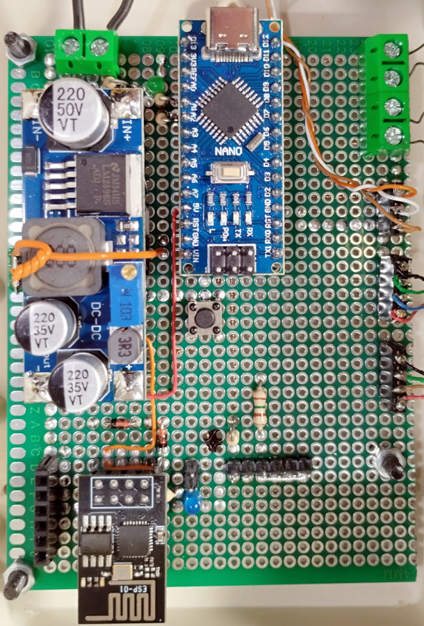
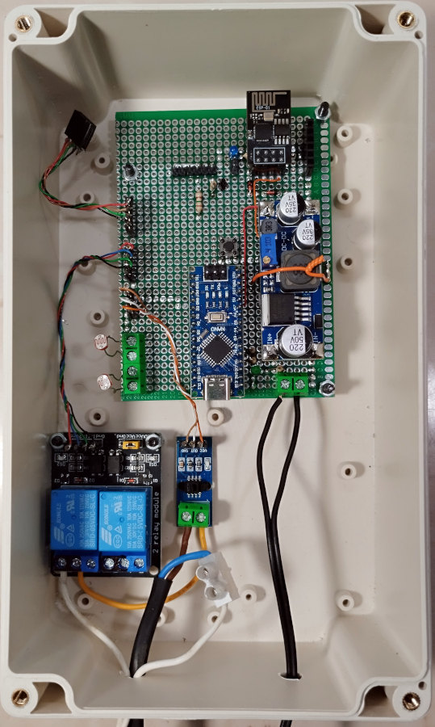
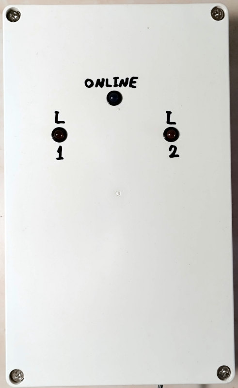
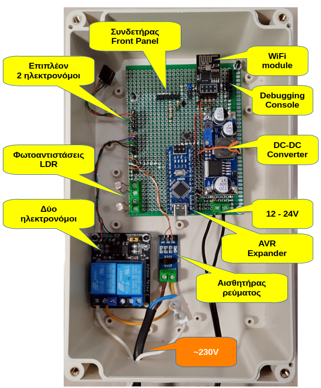

<H3>Β. Εξοικονόμηση ενέργειας</H3>
Κατασκευάσαμε μονάδα εποπτείας και ελέγχου σε δύο γραμμές φωτισμού για τον διάδρομο του Ε.Κ. Η μονάδα μετράει συνεχώς την κατανάλωση ενέργειας της παροχής και ανάβει μόνο τα απαραίτητα φώτα ανάλογα με το φως ημέρας. Η μονάδα επικοινωνεί μέσω διαδικτύου με το κεντρικό σύστημα διαχείρισης.

  

<H3>Κατασκευή ηλεκτρονικού κυκλώματος</H3>
Έγινε κατασκευή του πρωτοτύπου σε διάτρητη πλακέτα perfboard. Πάνω στην πλακέτα τοποθετήθηκαν όλα τα εξαρτήματα και τα αρθρώματα και κολλήθηκαν από την κάτω πλευρά με λεπτά σύρματα. Ακολουθεί το θεωρητικό κύκλωμα της μονάδας.

  

Η τελική μορφή του πρωτοτύπου και η τοποθέτηση του στο αδιάβροχο ηλεκτρολογικό κουτί.
<table align="center">
 <tr>
  <td></td>
  <td></td>
   <td></td>
  </tr>
</table>
Στην ακόλουθη εικόνα φαίνεται η περιγραφή των αρθρωμάτων και των συνδέσεων.

  

