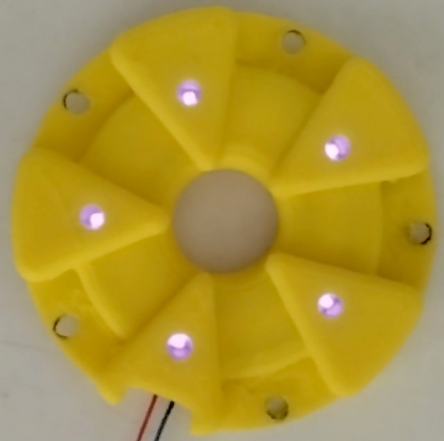
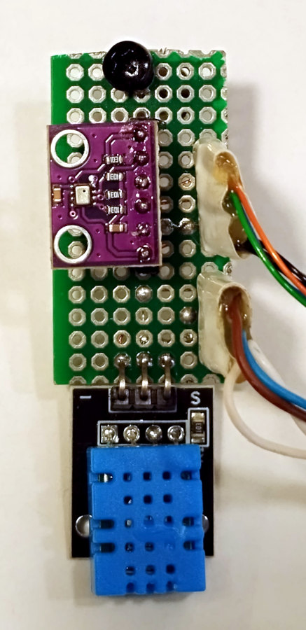

<H3>Γ. Μετεωρολογικός σταθμός</H3>
Σχεδιάσαμε και κατασκευάσαμε έναν μετεωρολογικό σταθμό ο οποίος επικοινωνεί μέσω διαδικτύου με τον κεντρικό σύστημα διαχείρισης ώστε τα δεδομένα να χρησιμοποιούνται από τις προηγούμενες μονάδες. Επίσης στέλνει τα μετεωρολογικά δεδομένα στην ανοιχτή πλατφόρμα WeatherCloud. Τα περισσότερα όργανα του μετεωρολογικού σταθμού τα κατασκευάσαμε στον εκτυπωτή 3D του σχολείου.

Ο μετεωρολογικός σταθμός καταγράφει 8 μετεωρολογικά μεγέθη. Σε σχέση με τον αρχικό σχεδιασμό δεν βάλαμε τον αισθητήρα καταμέτρησης κεραυνών διότι δεν βρήκαμε τον αισθητήρα στην ελληνική αγορά. Ακολουθεί το block διάγραμμα της μονάδας και η τελική υλοποίηση σε λειτουργία:

<table align="center">
 <tr>
  <td></td>
  <td></td>
  </tr>
</table>

<H3>Κατασκευή ηλεκτρονικού κυκλώματος</H3>
Έγινε κατασκευή του πρωτοτύπου σε διάτρητη πλακέτα perfboard. Πάνω στην πλακέτα τοποθετήθηκαν όλα τα εξαρτήματα και τα αρθρώματα και κολλήθηκαν από την κάτω πλευρά με λεπτά σύρματα. Ακολουθεί το θεωρητικό κύκλωμα της μονάδας.

  

 Στις ακόλουθες εικόνες φαίνεται η κατασκευή του πρωτοτύπου σε πλακέτα perfboard.

<table align="center">
 <tr>
  <td></td>
  <td></td>
  </tr>
</table>

Ακολουθεί η περιγραφή όλων των οργανών και παρουσιάζεται ο τρόπος κατασκευής τα σχέδια και ο τρόπος βαθμονόμησης:

## Ανεμόμετρο

Το ανεμόμετρο μετράει την ταχύτητα του ανέμου. Την ιδέα την βρήκαμε στο https://www.yoctopuce.com/EN/article/how-to-measure-wind-part-1 και τα αρχεία για την εκτύπωση 3D υπάρχουν στον κατάλογο 3D.

### Τροποποιήσεις

1. Ρουλεμάν. Τα δύο ρουλεμάν έχουν διαστάσεις 9mm(εξωτερ.), 5mm(εσωτερ.), 3mm(ύψος) και προέρχονται από κεφαλές παλαιών HDD 3,5".
2. Άξονας. Για άξονα χρησιμοποιήσαμε βίδα 5mm(4,9) και την κόψαμε σε μήκος 51mm. Στο κάτω άκρο χαράξαμε εγκοπή ώστε να μπαίνει πλακέ κατσαβίδι.
3. Επειδή υπάρχουν μικρά κενά στην εφαρμογή των ρουλεμάν με την φωλιά, κόβουμε κομμάτι αυτοκόλλητης αλουμινοταινίας 4,5mm x 100mm και τυλίγουμε 2-3 στροφές στην εξωτερική πλευρά των ρουλεμάν.
4. Το ίδιο γίνεται και στον άξονα στα δύο σημεία που εφάπτεται με τα ρουλεμάν. Ταινία αλουμινίου 6,5mm x 56mm και τυλίγουμε 2 στροφές στον άξονα.
5. Μεγαλώνουμε τις οπές στα καπάκια πάνω και κάτω σε διάμετρο 6,6 - 7mm ώστε να περνάει άνετα ο άξονας.
6. Στον εσωτερικό δίσκο με τις 4 σχισμές μεγαλώνουμε την κεντρική οπή σε 4mm και με σπειροτόμο 5mm κάνουμε στροφές. Για σταθεροποίηση, από την πάνω πλευρά βάζουμε ροδέλα στην οποία έχουμε κάνει στροφές και βιδώνει κόντρα.
7. Στον ρότορα με τα κουτάλια μεγαλώνουμε την οπή σε 4mm και κάνουμε στροφές.
8. Ο εσωτερικός δίσκος βιδώνεται στον άξονα. Το ίδιο γίνεται και στον ρότορα κρατώντας με κατσαβίδι πλακέ τον άξονα από κάτω.
9. Για φωτοδίοδο και φωτοτρανζίστορ χρησιμοποιούμε το υπέρυθρο TCRT5000. Βγάζουμε τα δύο στοιχεία από το πλαστικό πλαίσιο και βάζουμε το φωτοτρανζίστορ από την πάνω πλευρά και την φωτοδίοδο από την κάτω.
10. Η φωτοδίοδος συνδέεται στα +5V μέσω αντιστάτη 220Ω και ο συλλέκτης του τρανζίστορ πάει στα +5V. Στην πλακέτα ο εκπομπός γειώνεται μέσω αντιστάτη pulldown 1Κ.

Για την σύνδεση με την πλακέτα θέλουμε 3 καλώδια (5V, GND και τα δεδομένα από τον εκπομπό του φωτοτρανζίστορ που είναι παλμοί μεταβλητής συχνότητας ανάλογα με την ταχύτητα περιστροφής του ρότορα.)

<table align="center">
 <tr>
  <td></td>
  <td></td>
   <td></td>
   <td></td>
  </tr>
</table>

  

### Βαθμονόμηση

Μια μέρα με άπνοια τοποθετούμε το ανεμόμετρο σταθερά σε ένα αυτοκίνητο. Προσοχή !!! πρέπει να δεθεί πολύ σταθερά ώστε να αποφύγουμε ατυχήματα. Επίσης πρέπει να είναι αρκετά πάνω από την οροφή. Με ένα φορητό υπολογιστή συνδεδεμένο στο Arduino nano και παρουσιάζοντας τις μετρήσεις στο πρόγραμμα τερματικού PUTTY μετράμε τις στροφές / λεπτό της περιστροφής του ρότορα. (Για μια στροφή έχουμε 4 διακοπές). Καταγράφουμε τα rpm για ταχύτητες από 10 - 80Km/h με βήμα ανά 10Km/h. Αν υπάρχει μη γραμμική σχέση βάζουμε αυτές τις τιμές σε πίνακα και υπολογίζουμε τις ενδιάμεσες τιμές.  

## Ανεμοδείκτης

Ο ανεμοδείκτης δείχνει την κατεύθυνση του ανέμου. Την ιδέα την βρήκαμε στο https://www.yoctopuce.com/EN/article/how-to-measure-wind-part-2 και τα αρχεία για την εκτύπωση 3D υπάρχουν στον κατάλογο 3D. Ο ανεμοδείκτης μας χρησιμοποιεί την τεχνική του κώδικα Gray και συγκεκριμένα το Single Track Gray Code (STGC). Εδώ έχουμε 5 υπέρυθρα Led στο κάτω μέρος του οργάνου τα οποίο επισκιάζονται ή όχι ανάλογα με την θέση του δίσκου. Οι τρεις οπές του δίσκου έχουν μήκη σύμφωνα με τον κώδικα Gray 5 bit. Από την πάνω πλευρά υπάρχουν 5 υπέρυθρα φωτοτρανζίστορ ακριβώς απέναντι από καθένα Led. Οι δυνατοί συνδιασμοί που παράγονται με 5 bits είναι 32, αλλά σύμφωνα με τον τροποποιημένο κώδικα μπορούμε να έχουμε 30 συνδιασμούς. Δηλαδή 360 μοίρες / 30 = 12 μοίρες. Επομένως μπορούμε να ανιχνεύσουμε 30 διαφορετικές διευθύνσεις του ανέμου το οποίο είναι υπέρ αρκετό. Για τα υπέρυθρα Led και φωτοτρανζίστορ χρησιμοποιήθηκαν 5 TCRT5000. <a href="docs/Gray_code.pdf" title="Παρουσίαση κώδικα">Εδώ στο αρχείο</a> υπάρχουν οι συνδιασμοί του τροποποιημένου κώδικα που χρησιμοποιήσαμε.

  

### Τροποποιήσεις

Οι τροποποιήσεις είναι ίδιες με αυτές του ανεμόμετρου.

Για την σύνδεση με την πλακέτα θέλουμε 7 καλώδια (5V, GND και τα δεδομένα των 5 bits του κώδικα Gray.)

<table align="center">
 <tr>
  <td></td>
  <td></td>
   <td></td>
   <td></td>
  </tr>
</table>

<table align="center">
 <tr>
  <td></td>
  <td></td>
   <td></td>
  </tr>
</table>

  

### Βαθμονόμηση
Η βαθμονόμηση του ανεμοδείκτη είναι εύκολη. Φροντίζουμε να περιστρέψουμε όλο το σώμα του ανεμοδείκτη έτσι ώστε όταν ο ανεμοδείκτης είναι στραμμένος στις 0 μοίρες να δείχνει στον βορά.

## Μετρητής ύψους βροχής

Ο μετρητής ύψους βροχής μετράει την βροχόπτωση σε χιλιοστά. Τα αρχεία για την εκτύπωση 3D υπάρχουν στον κατάλογο 3D. Το νερό συλλέγεται από ένα χωνί διαμέτρου 9,6cm και οδηγείται σε ένα μηχανισμό τραμπάλας με δύο μικρά δοχεία στα άκρα. Όταν το δοχείο γεμίσει, η τραμπάλα γυρίζει λόγω της βαρύτητας και αδειάζει το νερό, ενώ το άλλο άκρο έχει ανέβει και γεμίζει από το χωνί. Όσο πιο πολύ είναι το νερό τόσο γρηγορότερα πάλλεται η τραμπάλα. Στα δύο άκρα έχουν τοποθετηθεί δύο μικροί μαγνήτες ίδιου βάρους. Εμείς ανιχνεύουμε τις ταλαντώσεις του ενός άκρου με έναν αισθητήρα hall. Το παλμικό σήμα οδηγείται σε ένα pin του arduino με δυνατότητα διακοπής. (External interrupt)  

  

### Τροποποιήσεις

Για άξονα χρησιμοποιήσαμε μια βίδα διαμέτρου 3mm και για μαγνήτες βάλαμε μικρά κομματάκια από μαγνήτη κίνησης της κεφαλής ενός σκληρού δίσκου. Σπάμε τον μαγνήτη σε μικρά κομμάτια ίδιου μεγέθους. Από τους δύο μαγνήτες μόνο ο ένας χρησιμοποιείται ενώ ο άλλος λειτουργεί ως αντίβαρο. Επίσης πρέπει να προσέξουμε στην τοποθέτηση των πόλων του ενεργού μαγνήτη ώστε το μαγνητικό πεδίο να επιδρά στον αισθητήρα hall. 

Για την σύνδεση με την πλακέτα θέλουμε 3 καλώδια (5V, GND και το παλμικό σήμα)

<table align="center">
 <tr>
  <td></td>
  <td></td>
  </tr>
</table>

  

### Βαθμονόμηση

Με μια σύριγγα στάζουμε νερό στην τραμπάλα και βρίσκουμε τα ml που χρειάζονται για να αλλάξει η κατάσταση. Είδαμε ότι με 3 ml αλλάζει η ισορροπία της τραμπάλας. Για μεγαλύτερη ακρίβεια χρησιμοποιούμε μια σύριγγα 20ml και στάζουμε αργά νερό στο χωνί και μετράμε παλμούς. Έτσι μετρήσαμε ότι για 20ml κάνει 7 παλμούς και για 40ml κάνει 14 παλμούς. Δηλαδή 20 / 7 = 2,9ml ανά παλμό. Επειδή κάνουμε διακοπή στον microcontroller με κάθοδο παλμού τότε για 3ml θα μετρήσει ένα παλμό. Και τώρα λίγοι υπολογισμοί:

Διάμετρος χωνιού 9,6cm δηλαδή ακτίνα 4,8cm δηλαδή εμβαδόν = π*r2 = 3.14 * 4,82 = 72,4cm2.
Επομένως αν το ύψος νερού είναι 10mm = 1cm τότε ο όγκος θα είναι 72,4cm2 * 1cm = 72,4cm3 ή 72,4ml.
72,4ml / 3ml = 24 παλμοί. Και σύμφωνα με τα παραπάνω δημιουργείται ο ακόλουθος πίνακας.

<table align="center">
 <tr>
  <td><strong>Ύψος</strong></td><td><strong>Όγκος</strong></td><td><strng>Παλμοί</strng></td>
 </tr>
 <tr>
  <td>10mm</td><td>72,4ml</td><td>24</td>
 </tr>
 <tr>
  <td>20mm</td><td>144,8ml</td><td>46</td>
 </tr>
 <tr>
  <td>30mm</td><td>217,2ml</td><td>72</td>
 </tr>
 <tr>
  <td>40mm</td><td>290ml</td><td>96</td>
 </tr> 
 <tr>
  <td>50mm</td><td>362,4ml</td><td>120</td>
 </tr>
</table>

Αν σε μια ώρα μετρήσουμε π.χ. 10 παλμούς τότε έχουμε 10 * 3 = 30ml / 7,24 = 4,1mm ύψος βροχής. Για κάθε 1mm ύψος βροχής ο μικροελεγκτής δέχεται 2,5 παλμούς. 
Ή για κάθε 1mm βροχής έχουμε όγκο 7,24ml => 7,24 / 2,9 = 2,5 παλμοί.

## Αισθητήρες ατμοσφαιρικής πίεσης, θερμοκρασίας και υγρασίας
Οι αισθητήρες αυτοί τοποθετούνται σε μια μικρή πλακέτα η οποία με την σειρά της τοποθετείται μέσα στον μετεωρολογικό κλωβό τύπου Stevenson που εκτυπώσαμε στον εκτυπωτή 3D. Για την θερμοκρασία και την ατμοσφαιρική πίεση χρησιμοποιήσαμε τον αισθητήρα BMP280 ο οποίος συνδέεται με το Arduino nano με διασύνδεση IIC. Για μέτρηση της σχετικής υγρασίας χρησιμοποιήσαμε τον αισθητήρα DHT11 ο οποίος παρέχει επιπλέον και μέτρηση θερμοκρασίας. Ο DHT11 συνδέεται με ένα ξεχωριστό σειριακό δίαυλο.

<table align="center">
 <tr>
  <td></td>
  <td></td>
  </tr>
</table>

## Αισθητήρες ακτινοβολίας UV και έντασης ηλιακής ακτινοβολίας

Για την μέτρηση του δείκτη υπέρυθρης ακτινοβολίας UV έχουμε την δυνατότητα να χρησιμοποιήσουμε δύο αισθητήρες. Τον αναλογικό SEN0162 ο οποίος συνδέεται σε μια αναλογική είσοδο του arduino nano ή τον ψηφιακό VEML6075 ο οποίος συνδέεται με δίαυλο IIC και είναι πολύ πιο ακριβής και ευαίσθητος από τον πρώτο. Εμείς στην τελική φάση προτιμήσαμε τον ψηφιακό.

Για την μέτρηση της έντασης ηλιακής ακτινοβολίας πρέπει να χρησιμοποιηθεί ένα ειδικό όργανο που ονομάζεται πυρανόμετρο. Επειδή έχει υψηλό κόστος προτιμήσαμε να βάλουμε ένα μικρό φωτοβολταϊκό 3x3cm το οποίο συνδέεται σε μια αναλογική είσοδο. Με την μέθοδο αυτή δεν έχουμε καλή ακρίβεια αλλά αρκετή για ένα μαθητικό έργο. Και τα δύο όργανα και ειδικά ο μετρητής ακτινοβολίας UV πρέπει να τοποθετηθούν έξω από κάθε κουτί ή τζάμι γιατί έχουμε μεγάλη απόσβεση της ακτινοβολίας UV. Για να προστατέψουμε τον αισθητήρα από την υγρασία τον περνάμε πολλές στρώσεις διάφανο πλαστικοποιητικό σπρέυ εκτός από το παραθυράκι για την είσοδο του φωτός.

<table align="center">
 <tr>
  <td></td>
  <td></td>
  </tr>
</table>

## Λογισμικό

Το λογισμικό όπως και στα άλλα υποσυστήματα είναι γραμμένο σε γλώσσα wiring (c - c++) και για τους δύο microcontrollers. Επιπλέον υπάρχει και αρκετή HTML, CSS και JavaScript (JQuery) για την υλοποίηση του web interface.

<table align="center">
 <tr>
  <td></td>
  <td></td>
  </tr>
</table>

Βίντεο δοκιμών του μετεωρολογικού σταθμού

