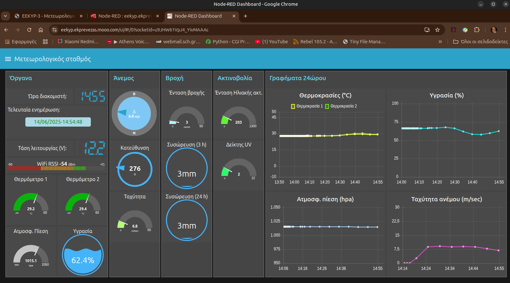
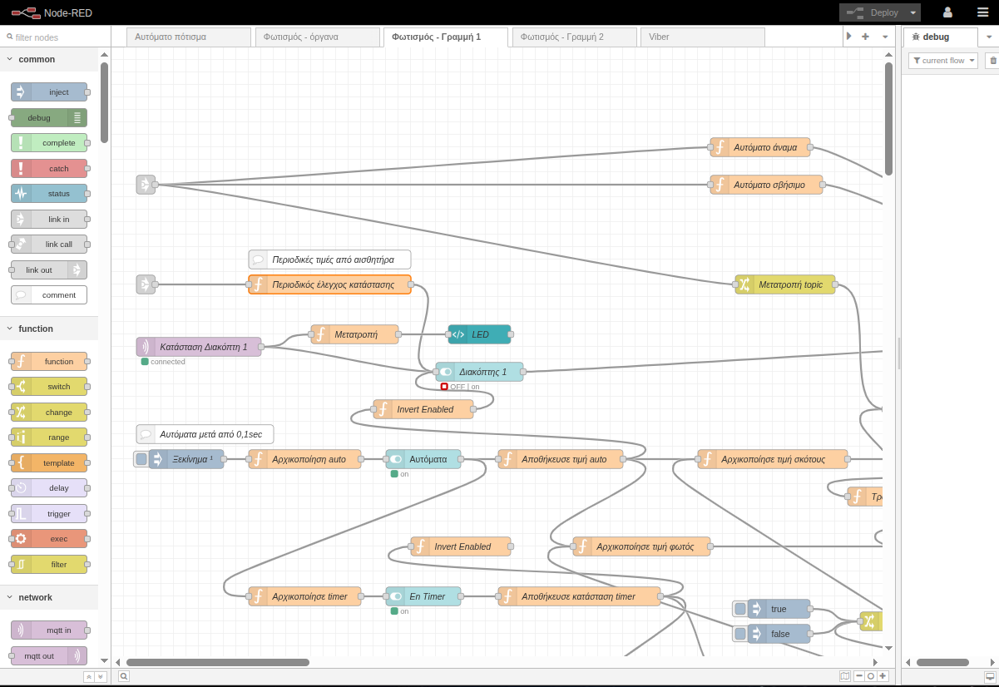

<H3>Δ. Κεντρικό σύστημα διαχείρισης</H3>

Αυτό είναι το σύστημα συλλογής και καταγραφής δεδομένων από τις προηγούμενες μονάδες. Έχει υλοποιηθεί με το λογισμικό ανοιχτού κώδικα Node RED το οποίο λειτουργεί σε έναν εικονικό διακομιστή (KVM) του Ε.Κ Πρέβεζας. Εδώ υπάρχουν τρεις καρτέλες (tabs) μία για κάθε υποσύστημα. Σε αυτό το υποσύστημα γίνεται η επεξεργασία των ακατέργαστων δεδομένων από τα τρία προηγούμενα. Έτσι μπορούν να ληφθούν αποφάσεις π.χ. πότε πρέπει να ξεκινήσει το πότισμα, πόσο νερό καταναλώθηκε τον προηγούμενο μήνα ή πότε πρέπει να ανάψουν τα φώτα κλπ. Επίσης τα δεδομένα καταγράφονται και παρουσιάζονται με γραφήματα. Τέλος υπάρχει η δυνατότητα αποστολής μηνυμάτων μέσω Viber ή Telegram ακόμη και ο χειρισμός των δύο πρώτων υποσυστημάτων.

Στην εικόνα φαίνεται η διεπαφή χρήστη του Node Red 

  

Και ο τρόπος προγραμματισμού με blocks και NodeJS (Java Script)

  

Βίντεο παρουσίασης των λειτουργιών του υποσυστήματος 3

